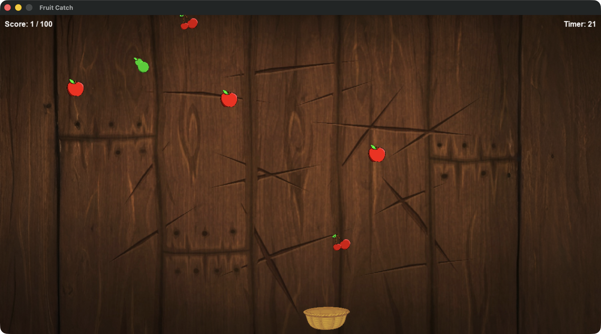
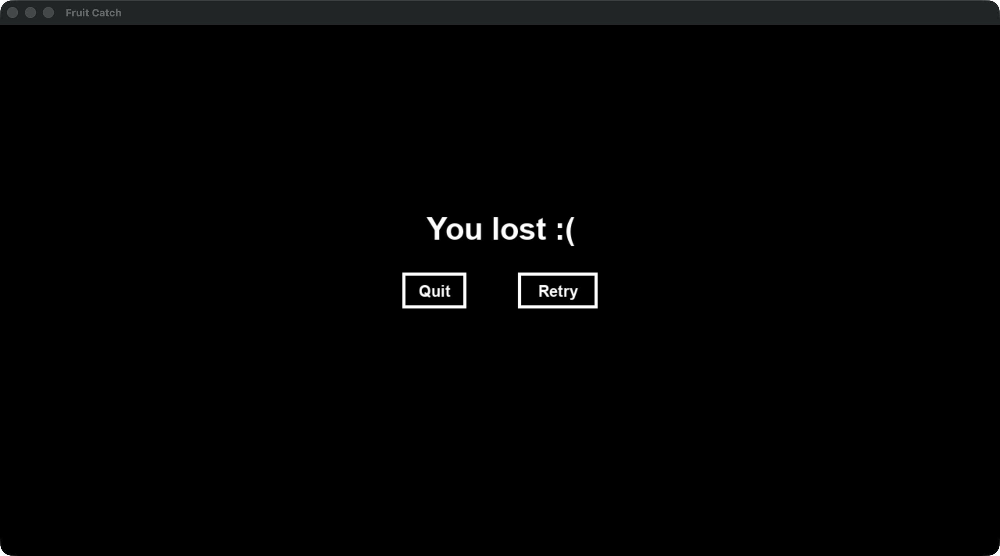

# Fruit Catch

Simple game of fruit catch written with pygame

## Controls
- move basket left: a
- move basket right: d

## Screenshots



## Setup
```bash
python3.12 -m venv .fruit_catch
source .fruit_catch/bin/activate
pip install -r requirements.txt
```
## Running
```bash
python src/fruit_catch.py
```